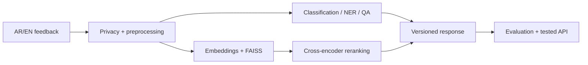

# Bayan — Bilingual Applied NLP Project

**Learner:** Shouq Khalid Aldossari  
**GitHub username:** AIShouq  
**Repository:** https://github.com/AIShouq/ShouqAldossari_Bayan_Applied_NLP  
**Final release tag:** `submission-v1.0`  
**Course:** Applied Natural Language Processing with Transformers (`SDA-AIE-211`)  
**Training context:** SDAIA Academy  
**Trainer:** Meaad Al-Marri — ميعاد المري

## Executive summary | الملخص

Bayan is an educational bilingual Arabic/English NLP system for analysing public-service feedback. It combines privacy-aware versioned preprocessing, topic and sentiment classification, named-entity recognition (NER), extractive QA with no-answer handling, multilingual semantic search, evaluation/error analysis, optimisation, and a tested API.

The project uses public educational course fixtures only and does not use real beneficiary data. Reported results are `MEASURED_SMOKE` results and are not presented as official frozen-cohort R1–R7 acceptance results.

## Reproduce on Google Colab Free

The instructor requested one cumulative notebook for the final project.

**Final executed notebook:** [`Bayan_Capstone_Shouq_Aldossari.ipynb`](https://github.com/AIShouq/ShouqAldossari_Bayan_Applied_NLP/blob/main/Bayan_Capstone_Shouq_Aldossari.ipynb)  
**Open in Colab:** [Run Bayan in Google Colab](https://colab.research.google.com/github/AIShouq/ShouqAldossari_Bayan_Applied_NLP/blob/main/Bayan_Capstone_Shouq_Aldossari.ipynb)

1. Open the notebook in Google Colab.
2. Use a clean runtime.
3. Install the pinned course requirements when prompted.
4. Run **Runtime → Restart session and run all**.
5. Use only the public course fixtures.
6. Compare outputs with `EVALUATION_REPORT.md`, `BENCHMARKS.md`, and `reports/technical_summary.json`.

## Architecture



## Measured results

| Component | Metric | Result | Workload |
|---|---|---:|---|
| Topic classification | Macro-F1 | **0.8667** | frozen public test, n=8 |
| Topic TF-IDF baseline | Macro-F1 | 0.7333 | same test |
| Sentiment classification | Macro-F1 | **0.5333** | frozen public test, n=8 |
| Sentiment TF-IDF baseline | Macro-F1 | 0.6667 | same test |
| NER | strict entity F1 | **0.6667** | public test |
| QA | answerable EM / token F1 | **0.0000 / 0.0000** | validation, n=2 |
| QA | public no-answer accuracy | **0.5000** | public test, n=2 |
| Search before rerank | Recall@10 / MRR@10 | **1.0000 / 0.7500** | public queries |
| Search after rerank | Recall@10 / MRR@10 | **1.0000 / 0.8194** | same queries |
| Cross-lingual search | Recall@10 / MRR@10 | **1.0000 / 0.7500** | n=4 |

Additional evidence: behavioural invariance **2/2**, minimum functionality **4/4**, topic accuracy **0.8750**, sentiment accuracy **0.7500**, NER precision/recall **1.0000/0.5000**.

## Optimisation and serving

Final decision: **`ADOPT_ONNX_FP32`**.

| Candidate | p50 ms | p95 ms | p99 ms | Throughput |
|---|---:|---:|---:|---:|
| PyTorch FP32 | 211.09 | 1027.27 | 1375.41 | 20.12 items/s |
| ONNX FP32 | 161.58 | 246.86 | 252.26 | 45.42 items/s |
| ONNX dynamic INT8 | 107.74 | 119.40 | 122.34 | 73.40 items/s |

ONNX FP32 preserved prediction agreement at **1.0** with max absolute logits difference about **2.62e-06**. INT8 was rejected because its measured quality tax was too high. HTTP smoke: concurrency **16**, requests **64**, p95 **1182.84 ms**, p99 **1454.39 ms**, throughput **15.48 req/s**.

## Error analysis

- `dialect_gap`: **4**
- `class_confusion`: **2**
- `truncation`: **2**

Priorities: dialect-aware handling, long-input re-audit, and class-specific confusion review.

## Measured extension

Dialect-router extension: baseline accuracy **0.5000**, extension accuracy **0.7778**, benefit **+0.2778**, added p95 cost **0.0876 ms**.

## Limitations

- Public fixtures are very small and are not representative of production traffic.
- Sentiment did not outperform its TF-IDF baseline on the tiny frozen test.
- NER recall remains limited.
- QA answerable EM/token-F1 remained weak; public no-answer accuracy was 0.50.
- Dialect, Arabizi, and long-input coverage remain limited.
- Colab latency is environment-dependent and does not establish a production SLA.

## Repository evidence

- `DATA_CARD.md`
- `MODEL_CARD.md`
- `EVALUATION_REPORT.md`
- `BENCHMARKS.md`
- `DECISIONS.md`
- `PROGRESS.md`
- `STUDENT_PROFILE.md`
- `PRESENTATION.md`
- `PROJECT_SUMMARY.json`
- `SUBMISSION.yml`
- `reports/technical_summary.json`
- `reports/presentation_demo.json`

## My contribution | مساهمتي

This is an individual project. I built and executed the cumulative Bayan notebook, implemented the preprocessing/privacy workflow, classification, NER, QA, bilingual semantic retrieval, evaluation/error analysis, optimisation/API evidence, and the measured dialect-router extension, and prepared the submission evidence package.

## AI assistance | الاستعانة بالأدوات

AI assistance was used for code review, debugging support, explanation, documentation drafting, and rubric/requirement checking. I reviewed the code and documentation, ran the submitted notebook in my own environment, and only report measurements produced by the executed notebook.

## Training context | السياق التدريبي

This educational project was developed during **Applied Natural Language Processing with Transformers (`SDA-AIE-211`)** in the **SDAIA Academy** training context.

Academy | الأكاديمية: [SDAIA Academy](https://github.com/SDAIAAcademy)  
Trainer | المدربة: **Meaad Al-Marri — ميعاد المري**  
Course source: https://github.com/almiyead-rgb/bayan-applied-nlp-course  

#SDAIAAcademy

## Final validation

Run the official final checks after the last upload and before hand-in:

```bash
PYTHONPATH=src python scripts/validate_submission.py . --require-tag
PYTHONPATH=src python scripts/preflight_submission.py . --require-tag
```

**Release/tag:** `submission-v1.0`

## Final hand-in acknowledgement | إقرار التسليم النهائي

I, **Shouq Khalid Aldossari**, reviewed the project requirements and understand that the submitted tagged version is the version to be graded and should not be replaced after hand-in. Final tag: `submission-v1.0`.

## License and acknowledgements

Project-authored code and documentation are released under the **MIT License**; see `LICENSE`. Third-party models, libraries, datasets, course materials, and institutional marks remain under their own licences/terms.
